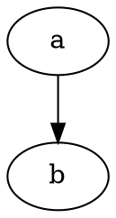

---
puppeteer:
  format: "A4"
  landscape: false
  printBackground: true
  margin:
    top: 25mm
    bottom: 25mm
    left: 25mm
    right: 25mm
---

@import "report.less"


<div class="title">ここがレポートのタイトルです</div>

<div class="name">ここが名前です</div>

# 目次

[TOC]

# 部

これが部の中身です。

## 章

これが章の中身です。

### 節

これが節の中身です。

#### 項

これが項の中身です。

##### 目

これが目の中身です。

## 基本構文

### 強調

_このテキストはイタリックです_

**このテキストは太字です**

_このように**組み合わせて**使うこともできます_

### リスト

#### 順不同リスト

- アイテム1
- アイテム2
  - アイテム2a
  - アイテム2b

#### 番号付きリスト

1. Item1
1. Item2
1. Item3
   1. Item 3a
   1. Item 3b
   1. Item 3c

### 画像


### リンク

https://github.com ←自動でリンクしてくれる [Github](https://github.com)

### 引用文

> ここに引用文を書きます。<br>脚注にもリンクできます。[^1]

### 水平線

---

### インラインコード

文の中に`<html>`埋め込めます。

### コードブロック

```ruby
require 'redcarpet'
markdown = Redcarpet.new("Hello World!")
puts markdown.to_html
```

```javascript {.line-numbers}
function add(x, y) {
  return x + y;
}
```

```javascript {highlight=2}
function add(x, y) {
  return x + y;
}
```

ファイルから直接読み込むことも出来ます。
@import "test.js" {code_block=true class="line-numbers"}


### タスクリスト

- [ ] item1
- [ ] item2
- [x] checked item

### 表

| 見出し1 | 見出し2 |
| ---- | ---- |
| セル1  | セル2  |

### 添え字

H~2~O

### マーク

==マーク==もできます

## 数式

直線の式は$y=x$です。

$$sin^2x+cos^2x=1$$

## ダイアグラム



[^1]: これは脚注です。
